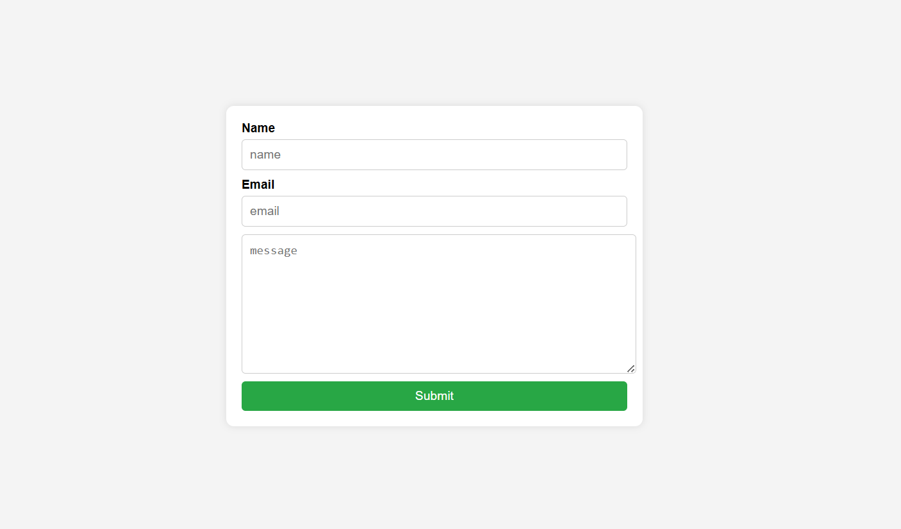
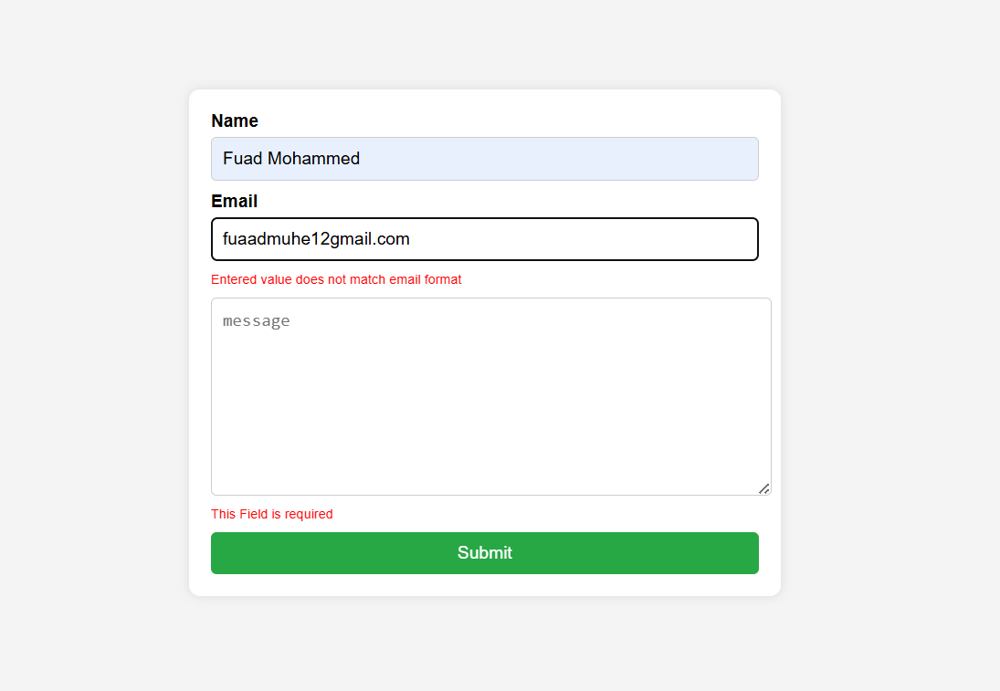
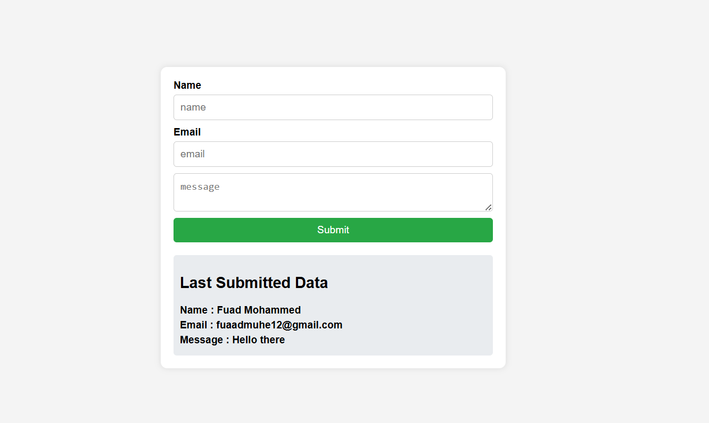

<!-- a simple react To do app REad me -->
# React Form App
This is a simple form app made with React. It has the following features:
- Add form
- validate form
- submit form
- show last form submitted

## Technologies:
- React with tsx
- CSS

## screenshots:

## How to run:
1. Clone this repository
2. Run `npm install` to install the dependencies
3. Run `npm start` to start the development server
4. Open `http://localhost:3000` to view the app in the browser

