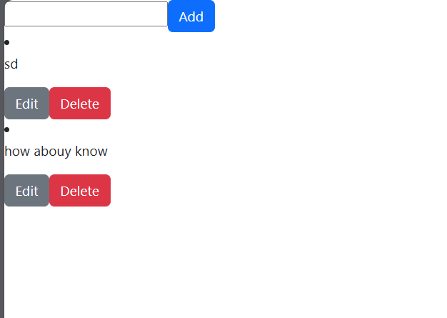

<!-- a simple react To do app REad me -->
# React To Do App

This is a simple to do app made with React. It has the following features:
- Add todo
- Delete todo
- Edit todo

## Technologies:
- React with tsx
- CSS

## screenshots:

## How to use:
- Add a todo by writing in the input field and pressing enter.
- Delete a todo by clicking on the delete icon.
- Edit a todo by double clicking on the todo text.
- Mark a todo as done/undone by clicking on the checkbox.

## How to run:
1. Clone this repository
2. Run `npm install` to install the dependencies
3. Run `npm start` to start the development server
4. Open `http://localhost:3000` to view the app in the browser

## Demo:
