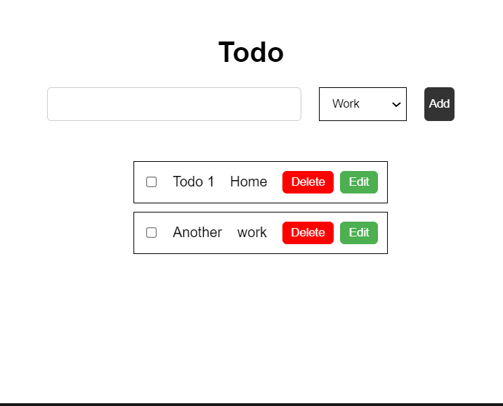

<!-- discribe about the project read me for a simple to do in js -->

## Features:
- Add todo
- Delete todo
- Edit todo
- Mark as done
- Mark as undone
- Filter todos

## Technologies:
- HTML
- CSS
- Ts

## screenshots:

## How to use:
- Add a todo by writing in the input field and pressing enter.
- Delete a todo by clicking on the delete icon.
- Edit a todo by double clicking on the todo text.
- Mark a todo as done/undone by clicking on the checkbox.

