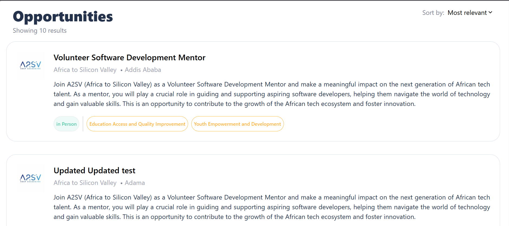
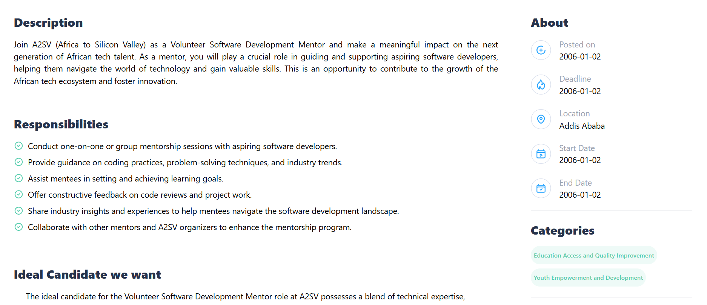

# Job Listing site
This is a job listing site where you see the list of jobs. You can also see the details of the job by clicking on the job.

## Installation
1. Clone the repository
2. Install the dependencies
```shell
npm install
```
3. Start the server
```shell
npm run dev
```
4. Open the browser and go to http://localhost:3000

## Technologies
- React
- Next.js
- Tailwind CSS
- Redux toolkit


## Features
- List of jobs
- Details of the job

## Screenshots



